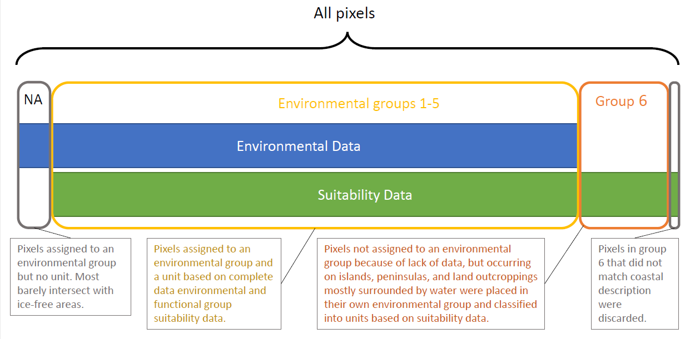

```{r setup, include=FALSE, results = "asis"}
library(tidyverse)
library(rgdal)
library(sp)
library(knitr)
library(DT)
library(ggfortify)
library(rgl)
library(viridis)
library(flextable)

#source('../scripts/Helper_Functions.R')
#load("../data/clean_hier_unit_datasets.RData")

```

### Introduction

This candidate ecosystem typology for Antarctica was created for the purposes of classifying functional ecosystem types appropriate for Red List of Ecosystem risk assessments. It focuses on permanently ice-free terrestrial areas of Antarctica and was produced at 1km grid cell resolution. Because of the paucity of ecosystem data available for Antarctica, the classification is based primarily on Landsat-based environmental variables and secondarily on habitat suitability models for several key functional groups. 

### Approach

After trialling several approaches, the typology was created using factor analysis. This is similar to a principal components analysis, but with more flexibility allowing for unique variance in the measured variables. Factor analysis looks for latent variables that account for shared variance among the measured variables. This approach was chosen because it is very straightforward and deterministic. While many more sophisticated clustering algorithms exist, most require some form of randomisation meaning that the results will be different (often significantly) between different runs. This is particularly true for Antarctic data, which does not exibit any clear-cut groupings. Furthermore, because Antarctica is understudied and its overall biogeography has received minimal attention, very little data exists that could be used to validate any clustering scheme, making it nearly impossible to choose a "best" solution from among candidate typologies that use randomisation. 

One goal was to preserve information about finer-scale variations in ecosystem types while accurately representing environmental conditions across the entire continent. To this end, we employed a two-step hierarchical approach. First, all pixels intersecting with an ice-free area were subjected to a factor analysis incorporating twelve environmental (abiotic) variables: `r abiotic`. Second, the resulting environmental groups were each subjected to a second factor analysis separately, this time based on suitability maps for functional groups. The results can be used to assign each pixel a value representing how well it fits into each grouping, and each pixel is placed into the group with the best fit. 

A large number of marginal/coastal pixels did not contain environmental data; these were placed in their own environmental group. Pixels with environmental data but lacking biotic suitability data were placed in environmental groups but did not receive a unit classification. Pixels which were left unclassified by this process were mostly marginal to ice-free areas and are therefore not a major concern.

{width=580px, height=300px}

### Results

The resulting classification scheme has 6 environmental supergroups (including the 'islands' group). Each supergroup has 4-7 subgroups determined by the suitability layers, for a total of 31 units. The environmental groups are as follows. 

```{r echo=FALSE, message=FALSE, warning=FALSE}
env_descr <- read_csv("Environment_group_table.csv")
#DT::datatable(env_descr)
flextable(env_descr) %>% width(width = c(1, .5, 1, 4))
```

Below is a visual overview of the classification of environmental groups. Each panel represents the range of values for one environmental variable in each environmental group. Cloud, melt, and precip are moisture availability variables. Temp, DDminus5, modT_0315, and sumtemp are temperature-related variables. Rad is solar radiation, which is calculated based on aspect. Elev = elevation; rugos = Rugosity; slope = slope of incline; wind = an average measure of the amount of wind. 

All variables have been scaled to a [0,1] range, so values are relative. 

```{r echo=FALSE, fig.height=10, fig.width=8, message=FALSE, warning=FALSE}
ggplot(ecodat %>% dplyr::filter(variable %in% abiotic), 
       aes(x = word(unit_h, 1, 1, sep = "_"), y = value, fill = word(unit_h, 1, 1, sep = "_"))) +
  geom_boxplot(outlier.size = 0.2) + facet_wrap(~variable) + labs(fill = "Environmental group", x = "Environmental Group")

```


Below are more detailed visual overviews of the variable range in each unit, plotted separately for each environmental group. These plots should help give a clearer idea of how the units are distinct from one another. Note that unit-level classification was done on suitability data alone, meaning that the environmental differences among units are likely reflected by differing biotas, even if they are slight. 

### Environmental group 1 (flat lowlands) variables by unit.


```{r echo=FALSE, message=FALSE, fig.height=10, fig.width=10, warning=FALSE}
group <- typ_df %>% dplyr::filter(typV2_fa_hier_12v %in% c(1:5)) %>% mutate(ecosystem = as.factor(typV2_fa_hier_12v))

# Full map
  ggplot() +  
    geom_polygon(data=antarctica, aes(x=long, y=lat, group=group), 
                 fill="gray50", color= NA, size=0.25) +
    geom_tile(data = typ_df, aes(x = x, y = y), fill = "gray35", col = "gray35", lwd = 0.8) + 
    geom_tile(data = group, aes(x=x, y=y, col= ecosystem, fill = ecosystem), lwd = 1.1) +
    scale_fill_viridis(discrete = TRUE) + scale_color_viridis(discrete = TRUE) +
    coord_equal() + labs(x = "x", y = "y")
```

```{r echo=FALSE, message=FALSE, fig.height=10, fig.width=10, warning=FALSE}
ecodat %>% filter(grepl("env1", unit_h), !grepl("NA", unit_h), variable %in% abiotic) %>% 
  ggplot(aes(x = unit_h, y = value, fill = unit_h)) + geom_boxplot(outlier.size = 0.3) + facet_wrap(~variable, scales = "free") + scale_fill_viridis(discrete = TRUE) + theme(axis.text.x = element_blank())
ecodat %>% filter(grepl("env1", unit_h), !grepl("NA", unit_h), variable %in% good_models) %>% 
  ggplot(aes(x = unit_h, y = value, fill = unit_h)) + geom_boxplot(outlier.size = 0.3) + facet_wrap(~taxon, scales = "free") + scale_fill_viridis(discrete = TRUE) + theme(axis.text.x = element_blank())

```

### Environmental group 2 (Mid-elevation snowy terrain) variables by unit

```{r echo=FALSE, message=FALSE, fig.height=10, fig.width=10, warning=FALSE}
group <- typ_df %>% dplyr::filter(typV2_fa_hier_12v %in% c(7:10)) %>% mutate(ecosystem = as.factor(typV2_fa_hier_12v))

# Full map
  ggplot() +  
    geom_polygon(data=antarctica, aes(x=long, y=lat, group=group), 
                 fill="gray50", color= NA, size=0.25) +
    geom_tile(data = typ_df, aes(x = x, y = y), fill = "gray35", col = "gray35", lwd = 0.8) + 
    geom_tile(data = group, aes(x=x, y=y, col= ecosystem, fill = ecosystem), lwd = 1.1) +
    scale_fill_viridis(discrete = TRUE) + scale_color_viridis(discrete = TRUE) +
    coord_equal() + labs(x = "x", y = "y")
```


```{r echo=FALSE, message=FALSE, fig.height=10, fig.width=10, warning=FALSE}
ecodat %>% filter(grepl("env2", unit_h), !grepl("NA", unit_h), variable %in% abiotic) %>% 
  ggplot(aes(x = unit_h, y = value, fill = unit_h)) + geom_boxplot(outlier.size = 0.3) + facet_wrap(~variable, scales = "free") + scale_fill_viridis(discrete = TRUE) + theme(axis.text.x = element_blank())
ecodat %>% filter(grepl("env2", unit_h), !grepl("NA", unit_h), variable %in% good_models) %>% 
  ggplot(aes(x = unit_h, y = value, fill = unit_h)) + geom_boxplot(outlier.size = 0.3) + facet_wrap(~taxon, scales = "free") + scale_fill_viridis(discrete = TRUE) + theme(axis.text.x = element_blank())

```


### Environmental group 3 (Rugged high mountains) variables by unit

```{r echo=FALSE, message=FALSE, fig.height=10, fig.width=10, warning=FALSE}
group <- typ_df %>% dplyr::filter(typV2_fa_hier_12v %in% c(12:16)) %>% mutate(ecosystem = as.factor(typV2_fa_hier_12v))

# Full map
  ggplot() +  
    geom_polygon(data=antarctica, aes(x=long, y=lat, group=group), 
                 fill="gray50", color= NA, size=0.25) +
    geom_tile(data = typ_df, aes(x = x, y = y), fill = "gray35", col = "gray35", lwd = 0.8) + 
    geom_tile(data = group, aes(x=x, y=y, col= ecosystem, fill = ecosystem), lwd = 1.1) +
    scale_fill_viridis(discrete = TRUE) + scale_color_viridis(discrete = TRUE) +
    coord_equal() + labs(x = "x", y = "y")
```


```{r echo=FALSE, message=FALSE, fig.height=10, fig.width=10, warning=FALSE}
ecodat %>% filter(grepl("env3", unit_h), !grepl("NA", unit_h), variable %in% abiotic) %>% 
  ggplot(aes(x = unit_h, y = value, fill = unit_h)) + geom_boxplot(outlier.size = 0.3) + facet_wrap(~variable, scales = "free") + scale_fill_viridis(discrete = TRUE) + theme(axis.text.x = element_blank())
ecodat %>% filter(grepl("env3", unit_h), !grepl("NA", unit_h), variable %in% good_models) %>% 
  ggplot(aes(x = unit_h, y = value, fill = unit_h)) + geom_boxplot(outlier.size = 0.3) + facet_wrap(~taxon, scales = "free") + scale_fill_viridis(discrete = TRUE) + theme(axis.text.x = element_blank())

```


### Environmental group 4 (Highland windy, sunny outcrops) variables by unit

```{r echo=FALSE, message=FALSE, fig.height=10, fig.width=10, warning=FALSE}
group <- typ_df %>% dplyr::filter(typV2_fa_hier_12v %in% c(18:22)) %>% mutate(ecosystem = as.factor(typV2_fa_hier_12v))

# Full map
  ggplot() +  
    geom_polygon(data=antarctica, aes(x=long, y=lat, group=group), 
                 fill="gray50", color= NA, size=0.25) +
    geom_tile(data = typ_df, aes(x = x, y = y), fill = "gray35", col = "gray35", lwd = 0.8) + 
    geom_tile(data = group, aes(x=x, y=y, col= ecosystem, fill = ecosystem), lwd = 1.1) +
    scale_fill_viridis(discrete = TRUE) + scale_color_viridis(discrete = TRUE) +
    coord_equal() + labs(x = "x", y = "y")
```


```{r echo=FALSE, message=FALSE, fig.height=10, fig.width=10, warning=FALSE}
ecodat %>% filter(grepl("env4", unit_h), !grepl("NA", unit_h), variable %in% abiotic) %>% 
  ggplot(aes(x = unit_h, y = value, fill = unit_h)) + geom_boxplot(outlier.size = 0.3) + facet_wrap(~variable, scales = "free") + scale_fill_viridis(discrete = TRUE) + theme(axis.text.x = element_blank())
ecodat %>% filter(grepl("env4", unit_h), !grepl("NA", unit_h), variable %in% good_models) %>% 
  ggplot(aes(x = unit_h, y = value, fill = unit_h)) + geom_boxplot(outlier.size = 0.3) + facet_wrap(~taxon, scales = "free") + scale_fill_viridis(discrete = TRUE) + theme(axis.text.x = element_blank())

```


### Environmental group 5 (Highland low-wind outcrops) variables by unit
```{r echo=FALSE, message=FALSE, fig.height=10, fig.width=10, warning=FALSE}
group <- typ_df %>% dplyr::filter(typV2_fa_hier_12v %in% c(24:28)) %>% mutate(ecosystem = as.factor(typV2_fa_hier_12v))

# Full map
  ggplot() +  
    geom_polygon(data=antarctica, aes(x=long, y=lat, group=group), 
                 fill="gray50", color= NA, size=0.25) +
    geom_tile(data = typ_df, aes(x = x, y = y), fill = "gray35", col = "gray35", lwd = 0.8) + 
    geom_tile(data = group, aes(x=x, y=y, col= ecosystem, fill = ecosystem), lwd = 1.1) +
    scale_fill_viridis(discrete = TRUE) + scale_color_viridis(discrete = TRUE) +
    coord_equal() + labs(x = "x", y = "y")
```


```{r echo=FALSE, message=FALSE, fig.height=10, fig.width=10, warning=FALSE}
ecodat %>% filter(grepl("env5", unit_h), !grepl("NA", unit_h), variable %in% abiotic) %>% 
  ggplot(aes(x = unit_h, y = value, fill = unit_h)) + geom_boxplot(outlier.size = 0.3) + facet_wrap(~variable, scales = "free") + scale_fill_viridis(discrete = TRUE) + theme(axis.text.x = element_blank())
ecodat %>% filter(grepl("env5", unit_h), !grepl("NA", unit_h), variable %in% good_models) %>% 
  ggplot(aes(x = unit_h, y = value, fill = unit_h)) + geom_boxplot(outlier.size = 0.3) + facet_wrap(~taxon, scales = "free") + scale_fill_viridis(discrete = TRUE) + theme(axis.text.x = element_blank())

```


### Environmental group 6 (Islands) variables by unit

```{r echo=FALSE, message=FALSE, fig.height=10, fig.width=10, warning=FALSE}
group <- typ_df %>% dplyr::filter(typV2_fa_hier_12v %in% c(30:36)) %>% mutate(ecosystem = as.factor(typV2_fa_hier_12v))

# Full map
  ggplot() +  
    geom_polygon(data=antarctica, aes(x=long, y=lat, group=group), 
                 fill="gray50", color= NA, size=0.25) +
    geom_tile(data = typ_df, aes(x = x, y = y), fill = "gray35", col = "gray35", lwd = 0.8) + 
    geom_tile(data = group, aes(x=x, y=y, col= ecosystem, fill = ecosystem), lwd = 1.1) +
    scale_fill_viridis(discrete = TRUE) + scale_color_viridis(discrete = TRUE) +
    coord_equal() + labs(x = "x", y = "y")
```


```{r echo=FALSE, message=FALSE, fig.height=10, fig.width=11, warning=FALSE}


ecodat %>% filter(grepl("env6", unit_h), !grepl("NA", unit_h), variable %in% good_models) %>% 
  ggplot(aes(x = unit_h, y = value, fill = unit_h)) + geom_boxplot(outlier.size = 0.3) + facet_wrap(~taxon, scales = "free") + scale_fill_viridis(discrete = TRUE) + theme(axis.text.x = element_blank())

```


