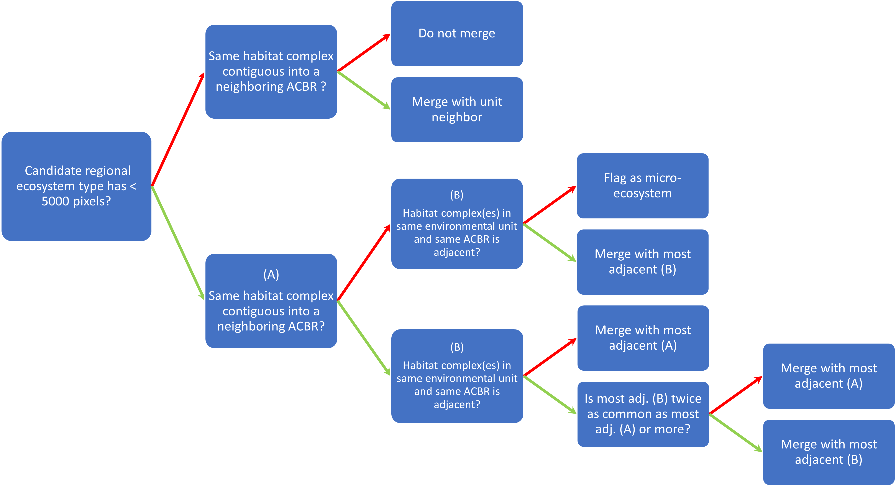

```{r setup, include=FALSE}
knitr::opts_chunk$set(echo = FALSE, warning = FALSE, message = FALSE)
source("../scripts/Helper_Functions.R")
library(dplyr)
library(ggplot2)
library(sf)
```

Regional units are necessary for a more local view of the Antarctic ice-free typology. Regional units are useful for performing targeted IUCN risk assessments. 

Regional units were generated by first taking the continental typology and intersecting it with the Antarctic Conservation Bioregions (ACBRs). This resulted in 387 potential units, some with as few as a single pixel. Regional units with tiny areas are unlikely to be regarded as unique ecosystems locally, so these original 387 units were subjected to a lumping process according to the logic tree below. 



This logic resulted in in 180 candidate regional units. Of these, 90 are a single unit-ACBR combination, and 90 consist of 2 or more lumped raw regional units. 34 units were discarded due to tiny area (largest had 3155 pixels, next largest had less than 1000) and no possibility of merging (no adjacent cells from same group). Because most pixels aren't filled with ice-free land, 3k pixels amounts to likely ~20km2. 

Below are maps of the proposed merges. Many are a very small unit lumped into a larger one which surrounds it. These seem pretty logical. 

A few of the proposed merges seem to go a bit too far by lumping too many units. It's up for discussion how to filter these. We can increase the amount of adjacent pixels required to merge units (right now this is 1, but we could increase it to 5 or 10). We can also decrease the minimum size of a unit for it to be standalone from 5000 pixels to 3000 or 2000 pixels.

A small number of lumped regional units have too few pixels to really be counted even after lumping. 10 lumped units have fewer than 3000 pixels and 8 have fewer than 2000 pixels.


```{r proposed_merges, include = TRUE, echo=FALSE, message=FALSE, warning=FALSE}
#p <- readRDS("../results/RegionalUnitsv5_plots.rds")
#load("../results/RUV5_plotdat.RData")

#for(i in which(m>1)){
#  p[[i]] + ggtitle(paste("Regional subunit", i, "with", n[i], "pixels"))
#}

antarctica <- st_read("../data/Base", "Coastline_high_res_polygon_v7.1") %>% st_simplify()
ru <- readRDS("../results/RegionalUnitsV5.rds")

for(i in unique(ru$final) %>% na.omit %>% as.numeric){
  curr.ru <- ru %>% filter(final == i)
  n <- nrow(curr.ru)
  m <- length(unique(curr.ru$ru))
  ext <- geo_bounds(curr.ru)
  bg <- df_crop(ru, ext, 5)
  bgpoly <- st_crop(antarctica, ext)

 if(m > 1){
    p <- ggplot() +  
    geom_sf(data = bgpoly, fill="gray50", color= NA, size=0.25) +
    geom_tile(data = bg, aes(x = x, y = y), fill = "gray35", col = "gray35", lwd = 0.8) +
    geom_tile(data = curr.ru, aes(x=x, y=y, col= ru, fill = ru), lwd = .8) +
    theme(plot.margin = unit(c(0,0,0,0), "cm"), 
          axis.text = element_text(size = 7), 
          axis.title = element_blank()) +
    ggtitle(paste("Regional subgroup", i, "with", n, "pixels"))+
    scale_y_continuous(labels = scales::scientific) + scale_x_continuous(labels = scales::scientific) 
  
  print(p)
 } 
 
}

```

